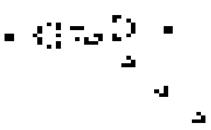

# Game of life

## Эта одна из самых первых игр
 в ней присутвуют только клетки которые могут становиться живими или
 мёртвыми.
обычно чёрным цветом обозначаються мёртвые клетки, а былим живые.
Игра в жизнь заканчиваеться только когда все клетки становяться мёртвыми.
В управление входит левая кнопка мышь делаеть кнопку либо живой либо мёртвой,
кнопка, кнопка r которая делает все клетки мёртвыми и кнопка p которая ставит игру на паузу
 ## правила в этой игре тоже простые
 * если у клетки менее 2 соседей или у неё больше 3 то онга умирает
 * если у клетки 3 или 2 соседа она делиться

## Настройки окружения

```shell
pip instal -r requirements.txt
```
```shell
python3 main.py
```

## Пример работы


